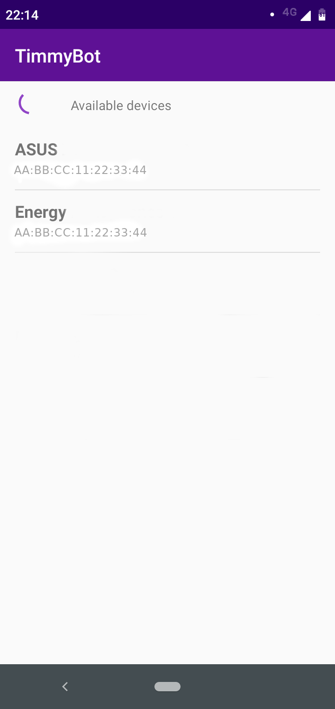

# TimmyBot_Android
TimmyBot_Android is an Android app to move TimmyBot robot, connected with Bluetooth.

# Use
```bash
git clone https://github.com/urbots/timmyBot.git
# Now open with Android Studio the android pruject, that is in path {repoPath}/timmyBot_android
# Once opened, you can deploy the app on an Android device
```

To control robot, you must pair the Android device with Arduino robot with Bluetooth. The Android app is going to ask for Bluetooth permissions and then, you will be able to connect the device by app.

# Interface
Scanning             |  Connected
:-------------------------:|:-------------------------:
   |  


# Requirements
We use [virtual-joystick-android](https://github.com/controlwear/virtual-joystick-android) to create a joystick.

In order to use this project, you must run with minimum sdk 21 (Android 5.0)

